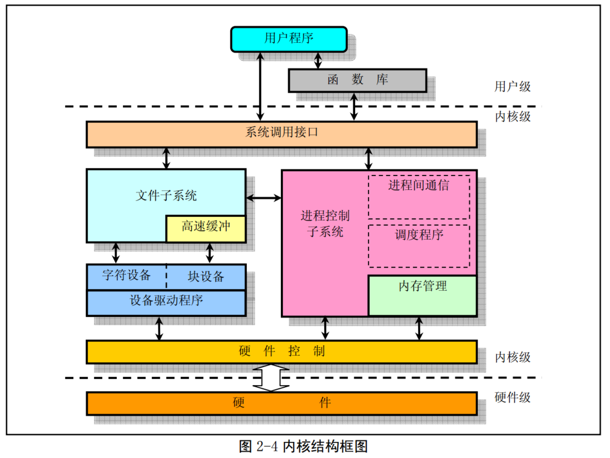

# 第一天

### 一、Linux操作系统的诞生依赖：

* UNIX操作系统
* MINIX操作系统
* GNU计划
* POSIX标准
* Internet网络

### 二、Linux内核体系结构

* 操作系统 = 硬件 + 操作系统内核 + 操作系统服务 + 用户应用程序

####  1、Linux内核模式： 整体式的单内核模式 + 层次式的微内核模式， 
* Linux 0.11采用的是单内核模式，优点在于内核代码结构紧凑、执行速度快、不足之处主要是层次结构不强。
* 在单内核模式下：应用主程序使用指定的参数值执行系统调用指令(int x80)，使CPU从用户态切换到核心态，然后操作系统根据具体的参数值调用特定的系统调用服务程序，而这些服务程序则根据需要调用底层的一些支持函数以完成特定的功能。在完成了应用程序所要求的服务后，操作系统又从核心态切换回用户态，返回到应用程序中继续执行后面的指令。
* 单核模式分层：主程序、系统服务、底层支持函数

#### 2、Linux内核系统体系结构(由5个模块组成)

* 进程调度模块：控制进程对CPU的使用
* 内存管理模块：确保所有进程能够安全的共享机器主内存区，同时还支持虚拟内存管理方式、利用文件系统把暂时不用的内存数据库交换到外部设备上去
* 文件系统模块：支持外部设备的驱动和存储
* 进程间通信模块：支持多种进程间的信息交互方式
* 网络接口模块：提供对多种网络通信标准的访问并支持许多网络硬件




### 三、中断机制

* 中断信号分为两类：硬件中断、软件中断
* 每个中断是由0-255之间的一个数字来标识。

### 四、系统定时

* 在Linux0.11内核中，PC几的可编程定时芯片Intel 8253被设置为10ms发出一次时钟中断（IRQ0）信号。
* 这个时间节拍就是系统运行的脉搏，称之为1个系统滴答，用jiffies变量累计自系统启动以来经过的时钟滴答数。

### 五、Linux进程控制

* 程序是可执行文件，而进程是一个执行中的程序实例。
* 分时技术的原理是将CPU运行时间划分为一个个规定长度的时间片，让每个进程在一个时间片内运行。每个时间片的时间很短（例如15个系统滴答==150毫秒）
* Linux 0.11内核最多可以有64个进程同时存在。
* 进程 = 可执行代码 + 数据 + 堆栈区
* 进程可以在内核态和用户态下执行，内核堆栈和用户堆栈是分开的。

#### 5.1 任务数据结构

* 内核程序通过进程表对进程进行管理，每个进程在表中占有一项
* 进程表项是一个task_struct任务结构指针，该结构定义在`include/linux/sched.h`头文件中，可以称之为进程控制块PCB或者进程描述符PD。其中保存了用于控制和管理进程的所有信息。
* CPU的所有寄存器中的值、进程的状态、以及堆栈中的内容被称为该进程的上下文，当内核需要切换到另一个进程时，当前线程的上下文就被保存在任务数据结构中，即task_struct中。

#### 5.2 进程运行状态

* 一个进程在生存期内，可处于一组不同的状态下，称之为进程状态。
* 当进程正在等待系统资源而处于等待状态时，则称之为处于睡眠等待状态，在Linux系统中，睡眠等待状态可被分为可中断和不可中断等待状态。

#### 5.3 进程初始化

* 从boot/目录中引导程序把内核从磁盘上加载到内存中，并让系统进入保护模式下运行后，就开始执行系统初始化程序`init/main.c`。
* 首先确定如何分配使用系统物理内存，然后调用内核各部分的初始化函数分别对内存管理、中断处理、块设备和字符设备、进程管理以及硬盘和软盘硬件进行初始化处理。
* 完成上述操作之后，系统各部分已经处于可运行状态，此后程序把自己“手工”移动到进程0中运行，并使用fork调用首次创建出进程1。
* 在进程1中，程序将继续进行应用环境的初始化并执行shell登录程序。而原进程0则会在系统空闲时被调度执行，此时进程0仅执行pause()系统调用，并又会调用调度函数。
* `sched_init()`，首先对任务0的运行环境进行设置，这包括人工预先设置好任务0数据结构各字段的值，在全局描述符表中添加任务0的任务状态段（TSS）和局部描述符表（LDT），并把他们分别加载到任务寄存器tr和局部描述符表寄存器ldtr中。

```c

void main(void)		
{			
 	ROOT_DEV = ORIG_ROOT_DEV;
 	drive_info = DRIVE_INFO;
	memory_end = (1<<20) + (EXT_MEM_K<<10);
	memory_end &= 0xfffff000;
	if (memory_end > 16*1024*1024)
		memory_end = 16*1024*1024;
	if (memory_end > 12*1024*1024) 
		buffer_memory_end = 4*1024*1024;
	else if (memory_end > 6*1024*1024)
		buffer_memory_end = 2*1024*1024;
	else
		buffer_memory_end = 1*1024*1024;
	main_memory_start = buffer_memory_end;
#ifdef RAMDISK
	main_memory_start += rd_init(main_memory_start, RAMDISK*1024);
#endif
	mem_init(main_memory_start,memory_end); /* 内存管理初始化 */
	trap_init();  /* 硬件中断向量初始化 */
	blk_dev_init(); /* 块设备初始化 */
	chr_dev_init(); /* 字符设备初始化 */
	tty_init(); /* tty 初始化 */
	time_init();  /* 设置开机启动时间 */
	sched_init(); /* 调度程序初始化 */
	buffer_init(buffer_memory_end); /* 缓冲管理初始化，建内存链表等 */
	hd_init();  /* 硬盘初始化* /
	floppy_init(); /* 软驱初始化 */
	sti();  /* 所有初始化工作都做完了，开启中断 */
	move_to_user_mode(); /* 移到用户模式 */
	if (!fork()) {		
		init();
	}
	
	for(;;) pause();
}
```


